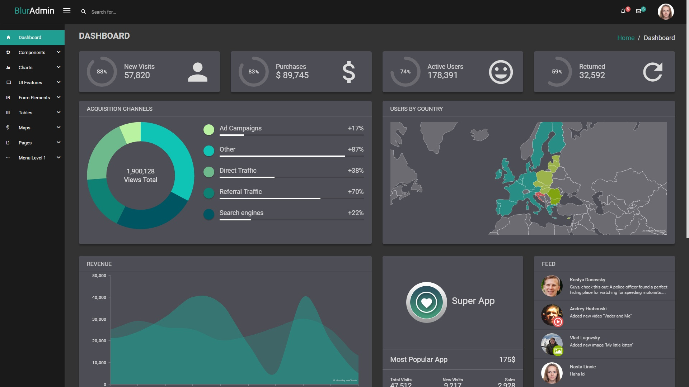

We tried to make the process of changing color scheme in BlurAdmin as easy as possible. 

By default BlurAdmin has two color profiles: mint and blur.
This article will help you to create your own color profile.
Let's say you want to make BlurAdmin dark.

First we advice you to take some colorscheme file as a basis. 
For light themes we suggest you to take `src/sass/theme/conf/colorScheme/_mint.scss` one and for dark take `src/sass/theme/conf/colorScheme/_blur.scss` one.
As we want dark theme, we're taking `blur`.

1) Copy `src/sass/theme/conf/colorScheme/_blur.scss` to `src/sass/theme/conf/colorScheme/_dark.scss`.

2) Include your colorscheme file in `src/sass/theme/common.scs`.

To do this, replace 
```scss
@import 'theme/conf/colorScheme/mint';
```

to

```scss
@import 'theme/conf/colorScheme/dark';
```

Now you can start changing your colors.
For example, after playing a bit with different colors, we changed 5 first main variables in `_dark.scss` file:
```sass
$default: rgba(#000000, 0.2); //Panel background color
$body-bg: #F0F3F4; // Body background color
$default-text: #ffffff; // Default text color
$help-text: #eeeeee; // Default subtext color
$label-text: #ffffff; // Text for labels in forms (Basically it should be equal to default-text in most cases)
```

After this is done, you need to setup javascript to use **same colors** while building charts and other javascript components.
To do this, add following code to some configuration block, for example to `src/app/theme/theme.config.js`:
```javascript
  baConfigProvider.changeColors({
    default: '#4e4e55',
    defaultText: '#e2e2e2',
  });
``` 

That's basically it! Right now your admin application should look like this:



For further reference, please look in
- Colorscheme scss file (`src/sass/theme/conf/colorScheme/_mint.scss` or `src/sass/theme/conf/colorScheme/_blur.scss`)
- `src/app/theme/theme.configProvider.js` to understand which javascript colors can be changed
- If you want to know how to change theme to blur, read [following article](/blur-admin/articles/014-switch-to-blur-theme/)